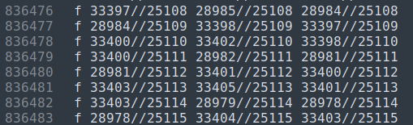

# Tutorial: Generating Synthetic Data with Python, Blender, and BlenderProc

## Introduction

Before we dive into the code, let's understand the tools we're using:


### Blender

Blender is a free, open-source 3D creation suite that supports the entire 3D pipeline, including modeling, rigging, animation, simulation, rendering, compositing, motion tracking, and video editing. We'll be focusing primarily on its 3D rendering capabilities.


3D rendering is the process of projecting a 3D scene onto a 2D image. The most basic 3D scene consists of three elements: a camera, a 3D object and a light source:


Once we set up these elements, we can instruct Blender to render the scene:


Blender supports Physically Based Rendering (PBR), an advanced technique that simulates realistic light bounces and material-light interactions to achieve photorealism. PBR is suitable for synthetic data generation, as it produces images closely resembling reality.


### 3D mehses
You are provided with 3D CAD models in .obj format of a needle holder and tweezers. There are several models for each instrument, with each model representing a different articulation angle.

 


A 3D .obj mesh is primarily constructed from two essential components:

Vertices: Points in 3D space that define the object's shape. Each vertex is represented by its x, y, and z coordinates. The .obj file lists vertices with a "v" prefix followed by their coordinates.


Faces: Polygons (typically triangles) that connect vertices to form the object's surface. Faces are defined by referencing the indices of the vertices they connect.
The .obj file lists faces with an "f" prefix followed by the vertex indices they use.



There is an accompanying .mat file that contains material information for the mesh, such as color, reflectivity, or other surface properties. This material data complements the geometric information in the .obj file to define the object's appearance.

You can view the meshes with software such as [Microsoft 3D viewer](https://apps.microsoft.com/detail/9nblggh42ths?rtc=1&hl=en-il&gl=IL) or [MeshLab](https://www.meshlab.net).


### BlenderProc

BlenderProc is an open-source project for creating synthetic data using Blender and Python. It's designed to make the process of generating large datasets for computer vision tasks easier and more efficient. As you will see, it simplifies many of the complex tasks involved in synthetic data generation, especially for tasks like object detection, segmentation, and pose estimation...


https://github.com/DLR-RM/BlenderProc


## Installation

Its highly recommended to have a compeletely seperate Python environment for synthetic data generation.
We will install blenderproc as in the blenderproc readme instructions. Make sure you have conda installed.

```
conda create -n synth python=3.10
conda activate synth
pip install blenderproc
```

The following will automatically install Blender for us:
```
blenderproc quickstart
```


## Usage

BlenderProc has to be run inside the blender python environment, as only there we can access the blender API. Therefore, instead of running your script with the usual python interpreter, the command line interface of BlenderProc has to be used.
```
blenderproc run <your_python_script>
```
For this reason you will find that you cannot simply debug through your IDE. For debugging instructions refer to the `Breakpoint-Debugging in IDEs` section in the official [BlenderProc README](https://github.com/DLR-RM/BlenderProc).


## Examples

The Blenderproc repository has many useful examples in the [examples folder](https://github.com/DLR-RM/BlenderProc/tree/main/examples). In this repo you will find examples that are targeted for our task.

### Examples in this repo:
- Render and paste on backgrounds: [examples/render_and_paste](examples/render_and_paste)
- Render on HDRI maps: [examples/render_on_hdri](examples/render_on_hdri)


