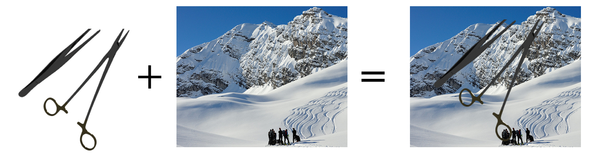

This is an enhanced version of the [random backgrounds](https://github.com/DLR-RM/BlenderProc/tree/main/examples/advanced/random_backgrounds) example from BlenderProc. In this example, objects are rendered on a transparent background in PNG format, and then a background image is added behind them.


 

# Usage example
```bash
blenderproc run examples/render_and_paste/main.py
python examples/render_and_paste/paste_on_random_background.py -i coco_data/images -b /datashare/project/train2017
```

# [main](main.py) code explanation

## Step 1: Loading and setting up the 3D model

First, load the 3D model and set up its materials:

```python
obj = bproc.loader.load_obj(args.scene)[0]
obj.set_cp("category_id", 1)
# obj.hide(True)
```

**Explanation**: The above code loads a 3D model in .obj format and assigns a category ID, which is used for segmentation labeling. You can hide objects if they aren’t required in the final render.

<span style="color: red;">Note:</span> Please be aware that `category_id=0` is reserved for the background and will be ignored during processing. Make sure to assign category IDs starting from 1 for objects you want to include in the segmentation.


## Step 2: Set the object materials
Next, apply random perturbations to the object's material properties:

```python
# Randomly perturbate the material of the object
mat = obj.get_materials()[0] # needle holder metal color
mat.set_principled_shader_value("Specular", random.uniform(0, 1))
mat.set_principled_shader_value("Roughness", random.uniform(0, 1))
mat.set_principled_shader_value("Metallic", 1)
mat.set_principled_shader_value("Roughness", 0.2)
```

**Explanation**: This sets the material properties of the object such as Specular, Roughness, and Metallic using the Principled BSDF shader (the standard shader).

The material is responsible for how the light interacts with the object.


### Roughness

 

### Metallic

 

Some object have more than one material. For example, the needle holder has one material for the metalic part (`mat = obj.get_materials()[0]`) and another material for the golden part on its handle (`mat = obj.get_materials()[1]`).

For more information on material properties, refer to the [Blender manual](https://docs.blender.org/manual/en/latest/render/shader_nodes/shader/principled.html).

## Step 3: Setting up lighting

Create and randomly position a point light around the object:

```python
light = bproc.types.Light()
light.set_type("POINT")
light.set_location(bproc.sampler.shell(
    center=obj.get_location(),
    radius_min=1,
    radius_max=5,
    elevation_min=1,
    elevation_max=89
))
light.set_energy(random.uniform(100, 1000))
```

**Explanation**: This step adds a point light, positions it randomly, and then sets random light intensity, providing variation in lighting conditions. Other light types can be explored in the [Blender manual](https://docs.blender.org/manual/en/latest/render/lights/light_object.html).

## Step 4: Camera setup
The following code sets the camera's intrinsic parameters:

```python
K = np.array([[fx, 0, cx], 
              [0, fy, cy], 
              [0, 0, 1]])
CameraUtility.set_intrinsics_from_K_matrix(K, im_width, im_height)
```
**Explanation**: 
K defines how 3D points are projected onto the 2D image plane.
- `fx` and `fy` are focal lengths in pixels.
- `cx` and `cy` are the coordinates of the image center.

<span style="color: red;">Note:</span> The provided camera intrinsics (fx, fy, cx, cy) are calibrated values. They have been precisely determined through a camera calibration process from the real data.

## Step 5: Camera positioning

Create multiple random camera poses:

```python

poses = 0
tries = 0
while tries < 10000 and poses < num_images:

    # Sample random camera location and rotation
    location = bproc.sampler.shell(
        center=obj.get_location(),
        radius_min=2,
        radius_max=10,
        elevation_min=-90,
        elevation_max=90
    )
    lookat_point = obj.get_location() + np.random.uniform([-0.5, -0.5, -0.5], [0.5, 0.5, 0.5])
    rotation_matrix = bproc.camera.rotation_from_forward_vec(lookat_point - location, inplane_rot=np.random.uniform(-0.7854, 0.7854))
    cam2world_matrix = bproc.math.build_transformation_mat(location, rotation_matrix)

    # Add camera pose if object is visible
    if obj in bproc.camera.visible_objects(cam2world_matrix):
        bproc.camera.add_camera_pose(cam2world_matrix, frame=poses)
        poses += 1
    tries += 1
```

**Explanation**: This code positions the camera randomly around the object while ensuring the object is visible in each pose. The sampler.shell function mimics the Horizontal coordinate system, controlling camera distance, elevation, and azimuth.

The `sampler.shell` function  is conceptually similar to the Horizontal coordinate system. Let's break it down:
The Horizontal coordinate system uses two main coordinates:


Altitude (or Elevation): The angular distance above or below the horizon.
Azimuth: The angle along the horizon from a fixed reference point (usually true north).

In this code:

Elevation is directly represented by the elevation_min and elevation_max parameters.
Azimuth is implicitly sampled across the full 360° range.
Distance (not part of the horizontal system but necessary in 3D space) is represented by radius_min and radius_max.

## Step 6: Rendering settings

Set the rendering parameters:

```python
bproc.renderer.set_max_amount_of_samples(100)
bproc.renderer.set_output_format(enable_transparency=True)
bproc.renderer.enable_segmentation_output(map_by=["category_id", "instance", "name"])
```

**Explanation**: This configures the renderer to generate images with transparency and segmentation masks. Reducing the sample count can speed up the rendering process.

## Step 7: Rendering and saving data

Render the images and save the output in COCO format:

```python
data = bproc.renderer.render()

bproc.writer.write_coco_annotations(os.path.join(args.output_dir, 'coco_data'),
                        instance_segmaps=data["instance_segmaps"],
                        instance_attribute_maps=data["instance_attribute_maps"],
                        colors=data["colors"],
                        mask_encoding_format="polygon",
                        append_to_existing_output=True)
```

**Explanation**: This step renders the images and saves the annotations in COCO format, commonly used for object detection and segmentation.

The mask_encoding_format parameter controls the format used for encoding segmentation masks when saving them in COCO format. There are two primary formats supported: RLE (Run-Length Encoding) and Polygon. 

## Step 8: Paste the background
Finally, overlay the rendered objects onto random background images:

```bash
python paste_on_random_background.py
```
**Explanation**: Use the [paste_on_random_background.py](paste_on_random_background.py) script to add background images behind the rendered objects, completing the image generation process.

