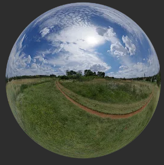

Unlike the render and paste approach ([examples/render_and_paste](examples/render_and_paste)), HDRI provides realistic background and lighting information to the scene.

You can think of it as an orb in 3D space that encapsulates your scene.

 


You are provided with lots of different HDRI's in the `/datashare/haven` folder.
[Haven](https://polyhaven.com) stores many free 3D assets, you can use any 3D asset.

Use the following code to apply a random HDRI to the scene from the Haven folder:

```python
# Set a random hdri from the given haven directory as background
random_hdr_file = random.choice(hdr_files)
bproc.world.set_world_background_hdr_img(random_hdr_file)
```

Make sure to disable background transparency
```python
bproc.renderer.set_output_format(enable_transparency=False)
```
